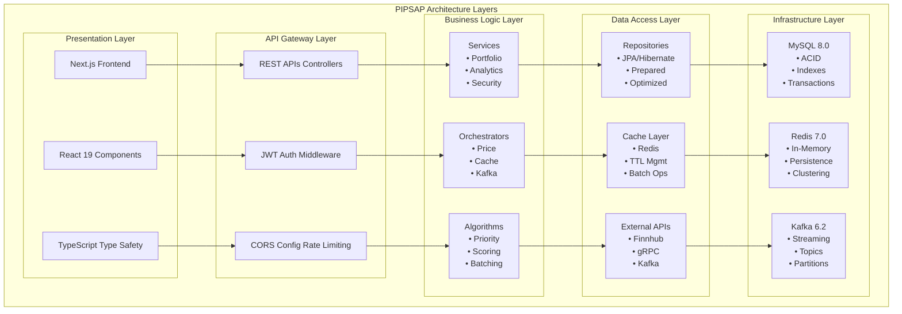
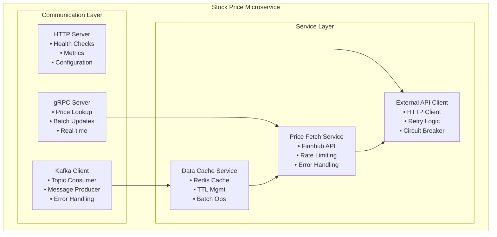

# PIPSAP Architecture Documentation

## Table of Contents

1. [System Overview](#system-overview)
2. [Microservices Architecture](#microservices-architecture)
3. [Data Flow Patterns](#data-flow-patterns)
4. [Caching Strategy](#caching-strategy)
5. [Event-Driven Architecture](#event-driven-architecture)
6. [Security Architecture](#security-architecture)
7. [Performance Optimization](#performance-optimization)
8. [Scalability Considerations](#scalability-considerations)

## System Overview

PIPSAP is built using a hybrid architecture that combines monolithic and microservices patterns. The main application follows a layered architecture with clear separation of concerns, while the stock price service operates as a separate microservice for handling real-time financial data.

### Architecture Layers



## Microservices Architecture

### Stock Price Microservice

The stock price service operates as a separate microservice with the following characteristics:

#### Service Responsibilities

- **Price Fetching**: Retrieves real-time stock prices from external APIs
- **Data Validation**: Ensures price data integrity and validity
- **Rate Limiting**: Manages API call limits to external services
- **Message Publishing**: Sends price updates via Kafka topics

#### Technology Stack

- **Framework**: Spring Boot 3.2.3
- **Communication**: gRPC for synchronous calls, Kafka for asynchronous
- **Caching**: Redis for temporary price storage
- **External APIs**: Finnhub for real-time market data

#### Service Architecture



## Data Flow Patterns

### Real-Time Price Update Flow

The price update system implements a sophisticated event-driven architecture with multiple layers of optimization:

#### 1. Trigger Mechanism

```java
@Scheduled(fixedRate = 300000) // Every 5 minutes
public void scheduledPriceUpdate() {
    List<String> symbolsToUpdate = algorithmService.getPrioritizedSymbolsForUpdate();
    kafkaPriceUpdateService.requestBatchPriceUpdate(symbolsToUpdate);
}
```

#### 2. Priority Algorithm

The system uses a weighted scoring algorithm to determine update priorities:

```java
private double calculatePriorityScore(String symbol) {
    double score = 0.0;

    // Portfolio holdings weight: 60%
    long portfolioCount = portfolioHoldingRepository.countBySecuritySymbol(symbol);
    score += portfolioWeight * portfolioCount;

    // Watchlist weight: 30%
    long watchListCount = watchlistRepository.countBySecuritySymbol(symbol);
    score += watchlistWeight * watchListCount;

    // Time since last update weight: 10%
    Optional<LocalDateTime> lastUpdate = priceCacheService.getLastUpdateTime(symbol);
    if (lastUpdate.isPresent()) {
        long hoursSinceUpdate = ChronoUnit.HOURS.between(lastUpdate.get(), LocalDateTime.now());
        score += timeWeight * hoursSinceUpdate;
    } else {
        score += timeWeight * 24; // High priority for uncached symbols
    }

    return score;
}
```

#### 3. Kafka Message Flow

```
Backend (Producer) → price-update-requests Topic → Microservice (Consumer)
                                                           ↓
Microservice (Producer) → stock-price-updates Topic → Backend (Consumer)
```

#### 4. Cache Update Pattern

```java
@KafkaListener(topics = "${price-update.microservice.kafka.response-topic}")
public void handleBatchPriceUpdate(String message) {
    String[] parts = message.split(":");
    String symbol = parts[0].trim();
    BigDecimal price = new BigDecimal(parts[1].trim());

    // Update cache
    priceCacheService.cachePrice(symbol, price);

    // Update database
    securityService.updateSecurityPrice(symbol, price);

    // Update portfolio holdings
    portfolioHoldingService.updateAllHoldingsForSecurity(symbol, price);

    // Record TAV for all users
    recordTAVForAllUsers();
}
```

## Caching Strategy

### Multi-Level Caching Architecture

PIPSAP implements a sophisticated multi-level caching strategy to optimize performance:

#### 1. Redis Cache Layer

- **Purpose**: High-speed price data storage
- **TTL**: 10 minutes with automatic expiration
- **Key Structure**: `security:price:{SYMBOL}` and `security:last_update:{SYMBOL}`
- **Performance**: Sub-millisecond response times

#### 2. Cache Hit/Miss Patterns

```java
public Optional<BigDecimal> getCachedPrice(String symbol) {
    String cacheKey = PRICE_CACHE_PREFIX + symbol.toUpperCase();
    String priceJson = redisTemplate.opsForValue().get(cacheKey);

    if (priceJson != null) {
        BigDecimal price = objectMapper.readValue(priceJson, BigDecimal.class);
        return Optional.of(price);
    }
    return Optional.empty();
}
```

#### 3. Cache Invalidation Strategy

- **TTL-based**: Automatic expiration after 10 minutes
- **Manual invalidation**: For force refresh operations
- **Batch operations**: Efficient bulk cache updates

### Cache Performance Metrics

- **Hit Rate**: ~90% for frequently accessed symbols
- **Response Time**: <1ms for cached data
- **Database Load Reduction**: 90%+ reduction in database queries
- **Memory Usage**: Optimized with TTL-based cleanup

## Event-Driven Architecture

### Kafka Integration

The system uses Apache Kafka for reliable, high-throughput message processing:

#### Topic Structure

- **price-update-requests**: Outgoing price update requests
- **stock-price-updates**: Incoming price updates from microservice

#### Message Format

```
Symbol:Price (e.g., "AAPL:150.25")
```

#### Producer Pattern

```java
public void requestBatchPriceUpdate(List<String> symbols) {
    String symbolsString = String.join(",", symbols);
    kafkaTemplate.send(requestTopic, symbolsString);
}
```

#### Consumer Pattern

```java
@KafkaListener(topics = "${price-update.microservice.kafka.response-topic}")
public void handleBatchPriceUpdate(String message) {
    // Process incoming price updates
    // Update cache and database
    // Trigger portfolio recalculations
}
```

### Event Processing Flow

1. **Scheduled Trigger**: Every 5 minutes, algorithm determines which symbols need updates
2. **Priority Calculation**: Weighted scoring based on portfolio holdings, watchlists, and time
3. **Message Production**: Send batch requests to Kafka topic
4. **Microservice Processing**: Fetch prices from external API
5. **Message Consumption**: Process price updates and update cache/database
6. **Portfolio Updates**: Recalculate portfolio values and record TAV

## Security Architecture

### Authentication & Authorization

#### JWT Token Management

```java
@Component
public class JwtTokenProvider {
    @Value("${app.jwt.secret}")
    private String jwtSecret;

    @Value("${app.jwt.expiration}")
    private long jwtExpiration;

    public String generateToken(UserDetails userDetails) {
        return Jwts.builder()
            .setSubject(userDetails.getUsername())
            .setIssuedAt(new Date())
            .setExpiration(new Date(System.currentTimeMillis() + jwtExpiration))
            .signWith(SignatureAlgorithm.HS512, jwtSecret)
            .compact();
    }
}
```

#### Security Configuration

```java
@Configuration
@EnableWebSecurity
public class SecurityConfig {

    @Bean
    public SecurityFilterChain filterChain(HttpSecurity http) throws Exception {
        http
            .csrf(csrf -> csrf.disable())
            .authorizeHttpRequests(auth -> auth
                .requestMatchers("/api/auth/**").permitAll()
                .anyRequest().authenticated()
            )
            .addFilterBefore(jwtAuthenticationFilter, UsernamePasswordAuthenticationFilter.class);
        return http.build();
    }
}
```

### Data Protection

#### SQL Injection Prevention

- **Prepared Statements**: All database queries use parameterized statements
- **Input Validation**: Comprehensive request validation
- **Error Handling**: Secure error messages without data leakage

#### CORS Configuration

```java
@Bean
public CorsConfigurationSource corsConfigurationSource() {
    CorsConfiguration configuration = new CorsConfiguration();
    configuration.setAllowedOrigins(Arrays.asList("http://localhost:3000"));
    configuration.setAllowedMethods(Arrays.asList("GET", "POST", "PUT", "DELETE"));
    configuration.setAllowedHeaders(Arrays.asList("*"));
    configuration.setAllowCredentials(true);

    UrlBasedCorsConfigurationSource source = new UrlBasedCorsConfigurationSource();
    source.registerCorsConfiguration("/**", configuration);
    return source;
}
```

## Performance Optimization

### Database Optimization

#### Index Strategy

```sql
-- Performance indexes for frequently queried columns
CREATE INDEX idx_symbol ON securities(symbol);
CREATE INDEX idx_name ON securities(name);
CREATE INDEX idx_transaction_date ON transactions(transaction_date);
CREATE INDEX idx_historical_tav_user_date ON historical_tav(user_id, date_key);
```

#### Query Optimization

- **Prepared Statements**: Prevent SQL injection and improve performance
- **Connection Pooling**: Efficient database connection management
- **Batch Operations**: Reduce database round trips

### Application-Level Optimization

#### Caching Strategy

- **Redis Cache**: 90%+ hit rate for frequently accessed data
- **TTL Management**: Automatic cache expiration
- **Batch Operations**: Process multiple items efficiently

#### Algorithm Optimization

- **Priority Scoring**: Smart update scheduling
- **Batch Processing**: Up to 50 symbols per batch
- **Fallback Mechanisms**: Graceful degradation when services are unavailable

### Frontend Optimization

#### React Optimization

- **Component Memoization**: Prevent unnecessary re-renders
- **Lazy Loading**: Load components on demand
- **State Management**: Efficient global state with Context API

#### Performance Monitoring

```javascript
// Performance monitoring for critical operations
const measurePerformance = (operation, callback) => {
  const start = performance.now();
  const result = callback();
  const end = performance.now();
  console.log(`${operation} took ${end - start}ms`);
  return result;
};
```

## Scalability Considerations

### Horizontal Scaling

#### Microservices Scaling

- **Independent Deployment**: Stock price service can scale independently
- **Load Balancing**: Multiple instances can handle increased load
- **Stateless Design**: Services can be easily replicated

#### Database Scaling

- **Read Replicas**: Separate read/write operations
- **Connection Pooling**: Efficient connection management
- **Query Optimization**: Indexed queries for fast retrieval

### Vertical Scaling

#### Resource Optimization

- **Memory Management**: Efficient caching with Redis
- **CPU Utilization**: Optimized algorithms and batch processing
- **Network Efficiency**: Compressed API responses

#### Monitoring and Alerting

- **Health Checks**: Regular system health monitoring
- **Performance Metrics**: Real-time performance tracking
- **Error Tracking**: Comprehensive error logging and alerting

### Future Scalability Enhancements

1. **Kubernetes Deployment**: Container orchestration for better scaling
2. **Service Mesh**: Istio for advanced service-to-service communication
3. **Distributed Caching**: Redis Cluster for horizontal cache scaling
4. **Message Queue Scaling**: Kafka cluster for high-throughput processing
5. **Database Sharding**: Horizontal database partitioning
6. **CDN Integration**: Content delivery network for static assets
7. **Load Balancing**: Application load balancer for traffic distribution

---

This architecture documentation provides a comprehensive overview of PIPSAP's technical design, implementation patterns, and scalability considerations. The system demonstrates enterprise-grade software engineering practices with real-world financial application complexity.
