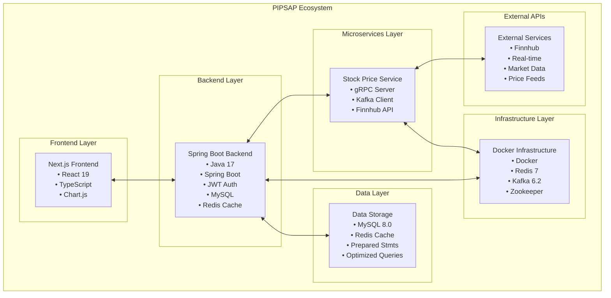
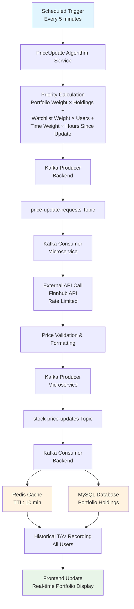
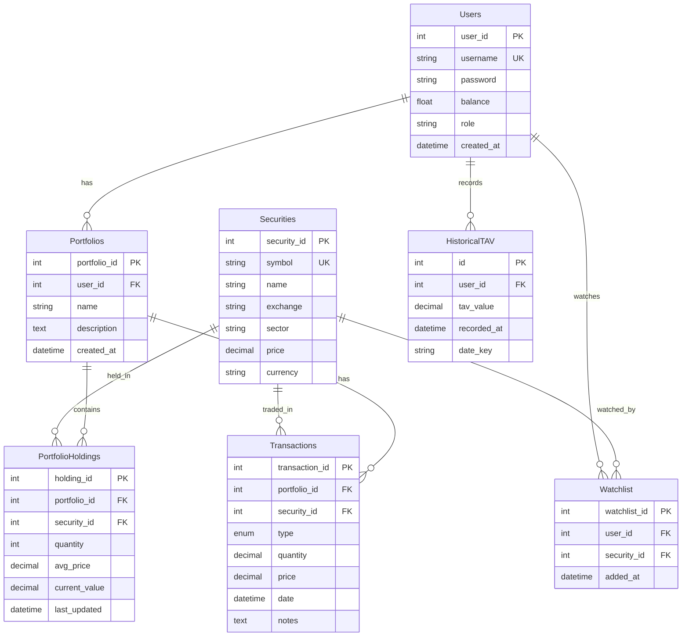

# PIPSAP - Personal Investment Portfolio System and Analytics Platform

## 🚀 Overview

PIPSAP is a sophisticated, enterprise-grade personal investment portfolio management system that demonstrates advanced software engineering practices, microservices architecture, and real-time financial data processing. Built as a comprehensive full-stack application, it showcases modern development techniques including distributed systems, caching strategies, event-driven architecture, and real-time analytics.


## 🏁 Getting Started

### Prerequisites

- Java 17 or higher
- Node.js 18 or higher
- Docker and Docker Compose

### Quick Start

1. **Clone the Repository**

   ```bash
   git clone https://github.com/yourusername/pipsap.git
   cd pipsap
   ```

2. **Start Infrastructure Services**

   ```bash
   docker-compose up -d
   ```

3. **Initialize Database**

   ```bash
   mysql -u root -p < ddl.sql
   mysql -u root -p < data.sql
   ```

4. **Start Backend Service**

   ```bash
   ./mvnw spring-boot:run
   ```

5. **Start Stock Price Microservice**

   ```bash
   cd services/stock-price-service
   ./mvnw spring-boot:run
   ```

6. **Start Frontend Application**

   ```bash
   cd frontend
   npm install
   npm run dev
   ```

7. **Access the Application**
   - Frontend: http://localhost:3000


## 🏗️ System Architecture

### High-Level Architecture Diagram



## 🔄 Real-Time Data Flow Architecture

### Price Update System Flow



## 🗄️ Database Schema Overview

### Core Entity Relationships



## ⚡ Performance & Scalability Features

### Caching Strategy

- **Redis Cache Layer**: 90%+ cache hit rate for frequently accessed symbols
- **TTL Management**: 10-minute cache expiration with automatic refresh
- **Batch Operations**: Up to 50 symbols processed per batch
- **Fallback Mechanism**: Database fallback when cache misses

### Priority-Based Updates

- **Portfolio Holdings**: 60% weight (highest priority)
- **Watchlist Items**: 30% weight (medium priority)
- **Time Since Update**: 10% weight (background priority)
- **Smart Batching**: Groups symbols by urgency and update frequency


## 🛠️ Technical Stack

### Backend Architecture

- **Framework**: Spring Boot 3.2.4 with Java 17
- **Security**: JWT-based authentication with Spring Security
- **Database**: Dockerized MySQL 8.0 instance with optimized indexes and prepared statements
- **Caching**: Redis 7.0 with TTL-based cache invalidation
- **Message Queue**: Dockerized Apache Kafka 6.2.0 for asynchronous processing
- **Microservices**: gRPC-based stock price service (future implementation), currently posts to Kafka topic
- **API**: RESTful endpoints with comprehensive error handling and rate limiting

### Frontend Architecture

- **Framework**: Next.js 15.3.1 with React 19
- **Language**: TypeScript for type safety
- **Charts**: Chart.js with react-chartjs-2 for data visualization
- **State Management**: React Context API for global state
- **Authentication**: JWT token management with secure storage

### Infrastructure

- **Containerization**: Docker with docker-compose for local development
- **Message Broker**: Dockerized Apache Kafka 6.2.0 with Zookeeper for distributed coordination
- **Cache**: Dockerized Redis 7.0 for high-performance data caching
- **Database**: Dockerized MySQL 8.0 instance with connection pooling and query optimization

## 🔐 Security Features

### Authentication & Authorization

- **JWT Tokens**: Secure token-based authentication
- **Role-Based Access**: User and admin role management
- **Password Security**: Encrypted password storage with bcrypt
- **Session Management**: Automatic token refresh with JWT

### Data Protection

- **Prepared Statements**: SQL injection prevention
- **Input Validation**: Comprehensive request validation
- **Error Handling**: Secure error messages without data leakage
- **CORS Configuration**: Cross-origin request security

## 📊 Key Features

### Portfolio Management

- **Multi-Portfolio Support**: Users can create and manage multiple portfolios
- **Real-time Valuation**: Live portfolio value updates with price changes
- **Transaction History**: Complete buy/sell transaction tracking
- **Performance Analytics**: Historical performance analysis and charts (TAV)

### Analytics & Reporting (future implementations)

- **Historical TAV Tracking**: Total Account Value history over time
- **Performance Charts**: Interactive charts for portfolio analysis
- **Sector Diversification**: Portfolio allocation by sector analysis
- **Transaction Analytics**: Detailed transaction reporting

### Real-time Data Processing

- **Live Price Updates**: Real-time security price updates
- **Automated TAV Recording**: Automatic total account value tracking
- **Cache Optimization**: Intelligent caching for performance
- **Priority-Based Updates**: Smart update scheduling based on user activity


## 📈 System Monitoring

### Health Check Endpoints

- `GET /api/price-updates/health` - System health status
- `GET /api/price-updates/statistics` - Update statistics
- `GET /api/price-updates/priorities` - Current update priorities

### Performance Monitoring

- Redis cache hit/miss rates
- Kafka message throughput
- Database query performance
- API response times
---

**PIPSAP** - Demonstrating enterprise-grade software engineering with real-world financial application complexity.
