# PIPSAP - Personal Investment Portfolio System and Analytics Platform

## 🚀 Overview

PIPSAP is a sophisticated, enterprise-grade personal investment portfolio management system that demonstrates advanced software engineering practices, microservices architecture, and real-time financial data processing. Built as a comprehensive full-stack application, it showcases modern development techniques including distributed systems, caching strategies, event-driven architecture, and real-time analytics.


## 🏗️ System Architecture

### High-Level Architecture Diagram

```mermaid
graph TB
    subgraph "PIPSAP Ecosystem"
        subgraph "Frontend Layer"
            A[Next.js Frontend<br/>• React 19<br/>• TypeScript<br/>• Tailwind CSS<br/>• Chart.js]
        end

        subgraph "Backend Layer"
            B[Spring Boot Backend<br/>• Java 17<br/>• Spring Boot<br/>• JWT Auth<br/>• MySQL]
        end

        subgraph "Microservices Layer"
            C[Stock Price Service<br/>• gRPC Server<br/>• Kafka Client<br/>• Redis Cache<br/>• Finnhub API]
        end

        subgraph "Infrastructure Layer"
            D[Docker Infrastructure<br/>• Docker<br/>• Redis 7<br/>• Kafka 6.2<br/>• Zookeeper]
        end

        subgraph "Data Layer"
            E[Data Storage<br/>• MySQL 8.0<br/>• Redis Cache<br/>• Prepared Stmts<br/>• Optimized Queries]
        end

        subgraph "External APIs"
            F[External Services<br/>• Finnhub<br/>• Real-time<br/>• Market Data<br/>• Price Feeds]
        end
    end

    A <--> B
    B <--> C
    B <--> D
    B <--> E
    C <--> F
    C <--> D
```



## 🔄 Real-Time Data Flow Architecture

### Price Update System Flow

```mermaid
flowchart TD
    A[Scheduled Trigger<br/>Every 5 minutes] --> B[PriceUpdate Algorithm Service]
    B --> C[Priority Calculation<br/>Portfolio Weight × Holdings +<br/>Watchlist Weight × Users +<br/>Time Weight × Hours Since Update]
    C --> D[Kafka Producer<br/>Backend]
    D --> E[price-update-requests Topic]
    E --> F[Kafka Consumer<br/>Microservice]
    F --> G[External API Call<br/>Finnhub API<br/>Rate Limited]
    G --> H[Price Validation & Formatting]
    H --> I[Kafka Producer<br/>Microservice]
    I --> J[stock-price-updates Topic]
    J --> K[Kafka Consumer<br/>Backend]
    K --> L[Redis Cache<br/>TTL: 10 min]
    K --> M[MySQL Database<br/>Portfolio Holdings]
    L --> N[Historical TAV Recording<br/>All Users]
    M --> N
    N --> O[Frontend Update<br/>Real-time Portfolio Display]

    style A fill:#e1f5fe
    style O fill:#e8f5e8
    style L fill:#fff3e0
    style M fill:#fff3e0
```



## 🗄️ Database Schema Overview

### Core Entity Relationships


## ⚡ Performance & Scalability Features

### Caching Strategy

- **Redis Cache Layer**: 90%+ cache hit rate for frequently accessed symbols
- **TTL Management**: 10-minute cache expiration with automatic refresh
- **Batch Operations**: Up to 50 symbols processed per batch
- **Fallback Mechanism**: Database fallback when cache misses

### Priority-Based Updates

- **Portfolio Holdings**: 60% weight (highest priority)
- **Watchlist Items**: 30% weight (medium priority)
- **Time Since Update**: 10% weight (background priority)
- **Smart Batching**: Groups symbols by urgency and update frequency

### Performance Metrics


## 🛠️ Technical Stack

### Backend Architecture

- **Framework**: Spring Boot 3.2.4 with Java 17
- **Security**: JWT-based authentication with Spring Security
- **Database**: MySQL 8.0 with optimized indexes and prepared statements
- **Caching**: Redis 7.0 with TTL-based cache invalidation
- **Message Queue**: Apache Kafka 6.2.0 for asynchronous processing
- **Microservices**: gRPC-based stock price service
- **API**: RESTful endpoints with comprehensive error handling

### Frontend Architecture

- **Framework**: Next.js 15.3.1 with React 19
- **Language**: TypeScript for type safety
- **Styling**: Tailwind CSS 4.0 for responsive design
- **Charts**: Chart.js with react-chartjs-2 for data visualization
- **State Management**: React Context API for global state
- **Authentication**: JWT token management with secure storage

### Infrastructure

- **Containerization**: Docker with docker-compose for local development
- **Message Broker**: Kafka with Zookeeper for distributed coordination
- **Cache**: Redis for high-performance data caching
- **Database**: MySQL with connection pooling and query optimization

## 🔐 Security Features

### Authentication & Authorization

- **JWT Tokens**: Secure token-based authentication
- **Role-Based Access**: User and admin role management
- **Password Security**: Encrypted password storage
- **Session Management**: Automatic token refresh

### Data Protection

- **Prepared Statements**: SQL injection prevention
- **Input Validation**: Comprehensive request validation
- **Error Handling**: Secure error messages without data leakage
- **CORS Configuration**: Cross-origin request security

## 📊 Key Features

### Portfolio Management

- **Multi-Portfolio Support**: Users can create and manage multiple portfolios
- **Real-time Valuation**: Live portfolio value updates with price changes
- **Transaction History**: Complete buy/sell transaction tracking
- **Performance Analytics**: Historical performance analysis and charts

### Watchlist & Alerts

- **Personal Watchlists**: User-specific security monitoring
- **Real-time Updates**: Live price updates for watched securities
- **Portfolio Integration**: Seamless watchlist-to-portfolio transfers

### Analytics & Reporting

- **Historical TAV Tracking**: Total Account Value history over time
- **Performance Charts**: Interactive charts for portfolio analysis
- **Sector Diversification**: Portfolio allocation by sector analysis
- **Transaction Analytics**: Detailed transaction reporting

### Real-time Data Processing

- **Live Price Updates**: Real-time security price updates
- **Automated TAV Recording**: Automatic total account value tracking
- **Cache Optimization**: Intelligent caching for performance
- **Priority-Based Updates**: Smart update scheduling based on user activity

## 🚀 Getting Started

### Prerequisites

- Java 17 or higher
- Node.js 18 or higher
- Docker and Docker Compose
- MySQL 8.0 (or use Docker)

### Quick Start

1. **Clone the Repository**

   ```bash
   git clone https://github.com/yourusername/pipsap.git
   cd pipsap
   ```

2. **Start Infrastructure Services**

   ```bash
   docker-compose up -d
   ```

3. **Initialize Database**

   ```bash
   mysql -u root -p < ddl.sql
   mysql -u root -p < data.sql
   ```

4. **Start Backend Service**

   ```bash
   ./mvnw spring-boot:run
   ```

5. **Start Stock Price Microservice**

   ```bash
   cd services/stock-price-service
   ./mvnw spring-boot:run
   ```

6. **Start Frontend Application**

   ```bash
   cd frontend
   npm install
   npm run dev
   ```

7. **Access the Application**
   - Frontend: http://localhost:3000
   - Backend API: http://localhost:8080
   - Stock Price Service: http://localhost:9090

## 📈 System Monitoring

### Health Check Endpoints

- `GET /api/price-updates/health` - System health status
- `GET /api/price-updates/statistics` - Update statistics
- `GET /api/price-updates/priorities` - Current update priorities

### Performance Monitoring

- Redis cache hit/miss rates
- Kafka message throughput
- Database query performance
- API response times

## 🔧 Configuration

### Application Properties

```yaml
price-update:
  cache:
    ttl-minutes: 10
    max-batch-size: 50
  algorithm:
    portfolio-weight: 0.6
    watchlist-weight: 0.3
    time-weight: 0.1
    min-update-interval-minutes: 5
  microservice:
    grpc:
      host: localhost
      port: 9090
    kafka:
      request-topic: price-update-requests
      response-topic: stock-price-updates
```

## 🧪 Testing

### Backend Tests

```bash
./mvnw test
```

### Frontend Tests

```bash
cd frontend
npm test
```

### Performance Tests

```bash
cd frontend/tests/performance
npm run test:performance
```

## 📚 API Documentation

### Authentication Endpoints

- `POST /api/auth/register` - User registration
- `POST /api/auth/login` - User authentication
- `POST /api/auth/refresh` - Token refresh

### Portfolio Endpoints

- `GET /api/portfolios` - Get user portfolios
- `POST /api/portfolios` - Create new portfolio
- `GET /api/portfolios/{id}` - Get portfolio details
- `PUT /api/portfolios/{id}` - Update portfolio

### Transaction Endpoints

- `POST /api/transactions` - Create transaction
- `GET /api/transactions` - Get transaction history
- `GET /api/transactions/{id}` - Get transaction details

### Analytics Endpoints

- `GET /api/analytics/tav-history` - Get TAV history
- `GET /api/analytics/portfolio-performance` - Portfolio performance
- `GET /api/analytics/sector-diversification` - Sector analysis

## 🤝 Contributing

This project demonstrates advanced software engineering practices and is intended as a portfolio piece. While not open for general contributions, the code serves as a reference for:

- Microservices architecture implementation
- Real-time data processing systems
- Event-driven architecture patterns
- High-performance caching strategies
- Full-stack development with modern technologies

## 📄 License

This project is licensed under the MIT License - see the [LICENSE](LICENSE) file for details.

## 🙏 Acknowledgments

- **Spring Boot Team**: For the excellent framework and ecosystem
- **Next.js Team**: For the powerful React framework
- **Redis Team**: For the high-performance caching solution
- **Apache Kafka**: For the distributed streaming platform
- **Finnhub**: For providing real-time financial data APIs
- **Open Source Community**: For the various tools and libraries used

---

**PIPSAP** - Demonstrating enterprise-grade software engineering with real-world financial application complexity.
